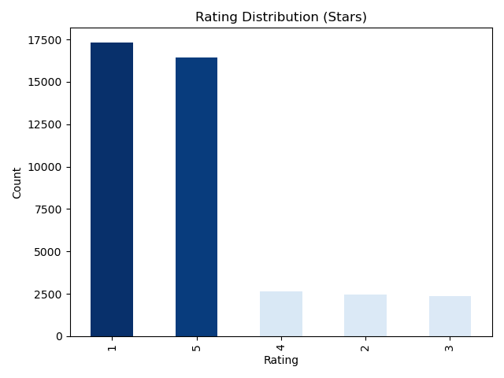

# Netflix Reviews Sentiment Analysis

## Table of Contents


### Project Overview

Analyze customer reviews from Netflix using Natural Language Processing (NLP) to classify feedback into **Positive**, **Neutral**, or **Negative** sentiments.  
This project helps visualize audience perceptions, uncover trends, and support data-driven decisions through an interactive **Streamlit web app**.


### Features
- **Data Collection** — Scrape Netflix reviews from Play Store & App Store  
- **Data Cleaning & Preprocessing** — Remove noise, clean text, handle duplicates  
- **Sentiment Analysis** — Classify reviews into 3 categories:  
  - Positive  
  - Neutral  
  - Negative  
- **Visualizations** — WordClouds, bar charts, sentiment trends  
- **Streamlit Dashboard** — Interactive interface for exploring insights  
- **Automation Scripts** — For fast, repeatable analysis


### Sentiment Categories

| Category  | Description |
|-----------|-------------|
| 👍 Positive | Indicates satisfaction, praise, or enthusiasm |
| 😐 Neutral | Balanced, factual, or non-emotional feedback |
| 👎 Negative | Expresses dissatisfaction, complaints, or frustration |


### Tech Stack

- **Python** — Core programming language  
- **Streamlit** — Interactive web app  
- **Pandas** — Data manipulation & analysis  
- **Scikit-learn** — Sentiment model training & evaluation  
- **NLTK** — Text preprocessing & tokenization
- **VADER Sentiment** — Rule-based sentiment scoring
- **Matplotlib & Seaborn** — Data visualization & charts
- **WordCloud** — Visualizing frequent keywords in reviews
- **Google Play Scraper** — Collecting Netflix app reviews from Play Store
- **Requests** — Web requests & API handling


### Dataset

This project includes Netflix review datasets:

- **[netflix_reviews_clean.csv](data/netflix_reviews_clean.csv)** - This file contains the processed Netflix reviews dataset after applying data cleaning steps to the raw scraped data.
- **[netflix_reviews_cleaned.csv](data/netflix_reviews_cleaned.csv)** – The cleaned dataset used for analysis and modeling.
- **[netflix_reviews_raw.csv](data/netflix_reviews_raw.csv)** – The original raw dataset.
- **[netflix_reviews_sample.csv](data/netflix_reviews_sample.csv)** – A small sample of 100 reviews for quick preview and GitHub display.

> 💡 Note: The full datasets are large and may not render in GitHub directly. Use the sample dataset to explore the data structure and for testing the app.


### Project Structure

```bash
netflix-sentiment-analysis/
│
├── assets/                  # Images, icons, or static assets
├── automation/              # Scripts for scheduled scraping & retraining
├── data/                    # Datasets
│   ├── netflix_reviews_clean.csv       # Reviews dataset after applying data cleaning steps to the raw scraped data
│   ├── netflix_reviews_cleaned.csv       # Cleaned dataset used for analysis
│   ├── netflix_reviews_raw.csv   # Original raw dataset
│   └── netflix_reviews_sample.csv    # Small sample dataset for GitHub preview
├── models/                  # Saved trained models & vectorizers
├── notebooks/               # Jupyter notebooks for experiments
├── scripts/                 # Reusable Python scripts
├── setup/                 # Reusable Python scripts
│   ├── setup_env.sh      # For Linux/Mac (bash)
│   ├── setup_env.bat     # For Windows (Command Prompt / PowerShell compatible)
├── .gitignore               # Ignored files & folders
├── README.md                # Project documentation
├── app.py                   # Streamlit app entry point
└── requirements_minimum.txt         # Python dependencies for a flexible environment with compatible newer versions
└── requirements.txt         # Python dependencies
```

### Setup & Usage

- Clone the Repository

```bash

git clone https://github.com/onatolumayowa/Netflix-Sentiment-Analysis.git
cd Netflix-Sentiment-Analysis

```

- Automatic Environment Setup (Recommended)

   - Linux / Mac or Windows with Bash (Git Bash / WSL):

   ```bash

   sh setup/setup_env.sh
   ```
   
   - Windows CMD / PowerShell users:

   ```bash

   setup\setup_env.bat
   ```

   ✅ Creates virtual environment, installs dependencies, and displays a success message.


- Activate the Environment

   - Linux / Mac (or Windows Bash):

   ```bash
   source venv/bin/activate
   ```

   - Windows CMD / PowerShell:

   ```bash
   venv\Scripts\activate
   ```

   Tip: You must activate the environment before running notebooks, scripts, or the Streamlit app.


- Manual Virtual Environment Setup (Optional)

   - Using conda (recommended):
 
   ```bash
   conda create -n netflix_review python=3.11
   conda activate netflix_review
   ```

   - Or using venv:

   ```bash

   python -m venv venv
   venv\Scripts\activate     # On Windows
   # or
   source venv/bin/activate  # On Mac/Linux
   ```

- Install Dependencies

```bash

pip install -r requirements.txt
```

- Launch the Streamlit app

```bash
streamlit run app.py
```
Then open 👉 http://localhost:8501/ in your browser.

- Recommended Setup for First-Time Users

   - Easiest & fastest: Use the automatic setup scripts (setup_env.sh for Linux/Mac or Git Bash, setup_env.bat for Windows CMD/PowerShell). This sets up the virtual environment and installs all dependencies in one command.

   - Alternative manual method: If you prefer full control or are using Conda, follow the manual virtual environment setup section above.

   - Flexible package versions: To allow minor future updates without breaking the project, you can replace requirements.txt with requirements_minimum.txt in the scripts or pip install command.


### Environment Setup Note

- For a fully reproducible setup (exact same versions used in this project), run: pip install -r requirements.txt

- For a flexible environment with compatible newer versions, run: pip install -r requirements_minimum.txt


### Model Pipeline

- Text Preprocessing

   - Lowercasing, punctuation removal, tokenization

   - Stopword removal & lemmatization (NLTK)

- Feature Extraction

   - TF-IDF vectorization

- Model Training

   - Logistic Regression (Scikit-learn)

   - Class imbalance handled with SMOTE

- Evaluation

   - Confusion matrix, classification report, accuracy metrics

- Saving & Deployment

   - Trained models & vectorizers saved in models/

   - Loaded in Streamlit for live predictions


### Streamlit App

The Streamlit dashboard offers an interactive interface to explore sentiment insights:

- Upload or view Netflix review datasets

- Visualize sentiment distribution and word clouds

- Filter by date, rating, or sentiment category

- Explore interactive analytics and trends

Run the dashboard with:

```bash
streamlit run app.py
```

Then open http://localhost:8501/


### Automation Plan

The project supports end-to-end automation to keep data and models fresh:

- Data Collection — Pull reviews from App Store & Play Store using scraping scripts

- Processing — Clean text, classify sentiment, save to data/

- Visualization — Generate summary reports and update dashboards

- Deployment — Schedule periodic scraping & automatic redeployment


### Deployment

Deploy the app to make it accessible online:

- https://streamlit.io/cloud - simplest no-code hosting

- **Render / Hugging Face Spaces** — flexible free hosting platforms

- **Docker** — for CI/CD and containerized deployment


### Author

**Onatolu Mayowa**  
For collaborations or feedback — feel free to connect!

📧 Email: [onatolumayowa2019@gmail.com](mailto:onatolumayowa2019@gmail.com)  
💼 LinkedIn: [https://linkedin.com/in/onatolu-mayowa](https://linkedin.com/in/onatolu-mayowa)  
🐦 Twitter: [https://x.com/OnatoluMayor](https://x.com/OnatoluMayor)  
🐙 GitHub: [https://github.com/onatolumayowa](https://github.com/onatolumayowa)  
🌐 Portfolio: [https://OnatoluMayowa.github.io](https://OnatoluMayowa.github.io)


### License

This project is open-source and available under the **MIT License**.

# image




